# アーキテクチャ図集

## 1. システム全体構成図

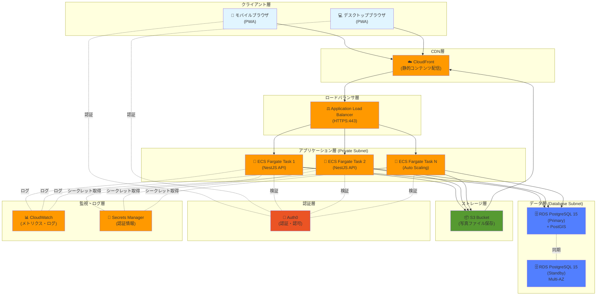

---

## 2. ネットワーク構成図 (VPC)

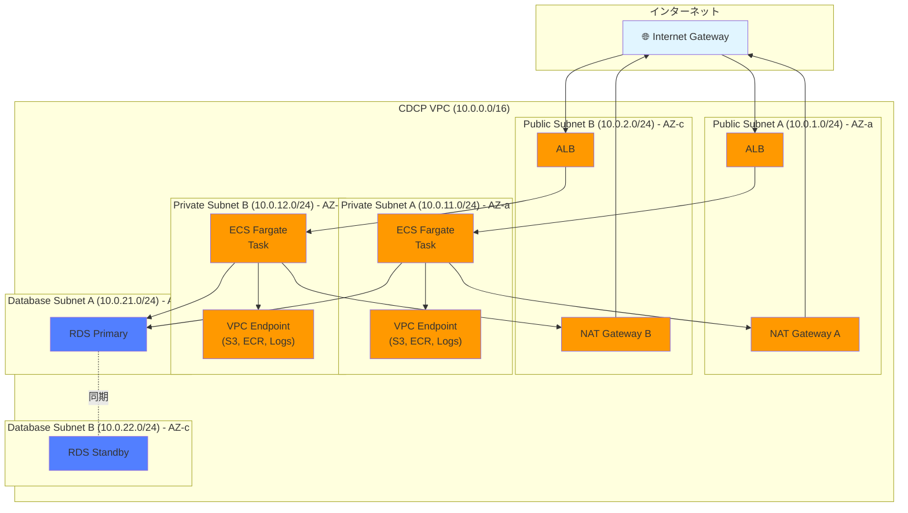

---

## 3. モノレポ プロジェクト構造図

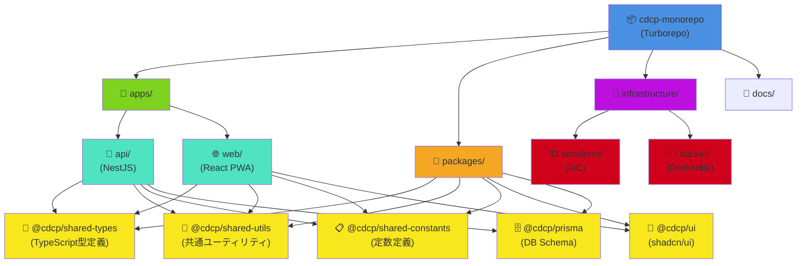

---

## 4. NestJS バックエンド アーキテクチャ (4層構造)

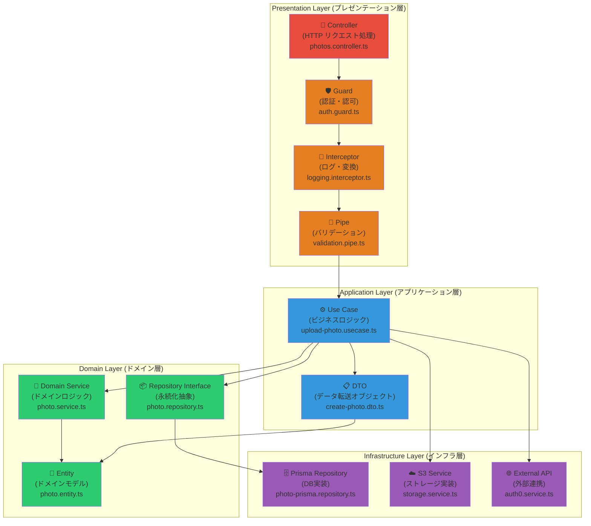

---

## 5. Phase1 写真管理モジュール依存関係図

```mermaid
graph TB
    subgraph "Phase1 Core Modules"
        PhotosModule["📷 PhotosModule<br/>(写真管理)"]
        ProjectsModule["📁 ProjectsModule<br/>(案件管理)"]
        UsersModule["👤 UsersModule<br/>(ユーザー管理)"]
        AuthModule["🔐 AuthModule<br/>(認証)"]
        StorageModule["☁️ StorageModule<br/>(S3ストレージ)"]
    end

    subgraph "Common Modules"
        DatabaseModule["🗄️ DatabaseModule<br/>(Prisma)"]
        ConfigModule["⚙️ ConfigModule<br/>(環境変数)"]
        LoggerModule["📝 LoggerModule<br/>(ログ)"]
        MetricsModule["📊 MetricsModule<br/>(メトリクス)"]
    end

    PhotosModule --> ProjectsModule
    PhotosModule --> UsersModule
    PhotosModule --> StorageModule
    PhotosModule --> DatabaseModule

    ProjectsModule --> UsersModule
    ProjectsModule --> DatabaseModule

    UsersModule --> AuthModule
    UsersModule --> DatabaseModule

    AuthModule --> ConfigModule

    StorageModule --> ConfigModule
    StorageModule --> LoggerModule

    DatabaseModule --> ConfigModule

    MetricsModule --> ConfigModule

    style PhotosModule fill:#e74c3c
    style ProjectsModule fill:#3498db
    style UsersModule fill:#2ecc71
    style AuthModule fill:#f39c12
    style StorageModule fill:#9b59b6
    style DatabaseModule fill:#34495e
    style ConfigModule fill:#95a5a6
    style LoggerModule fill:#95a5a6
    style MetricsModule fill:#95a5a6
```

---

## 6. React PWA フロントエンド 状態管理フロー

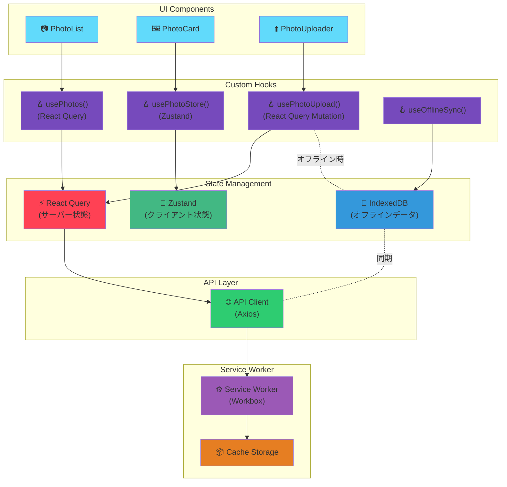

---

## 7. 写真アップロード シーケンス図

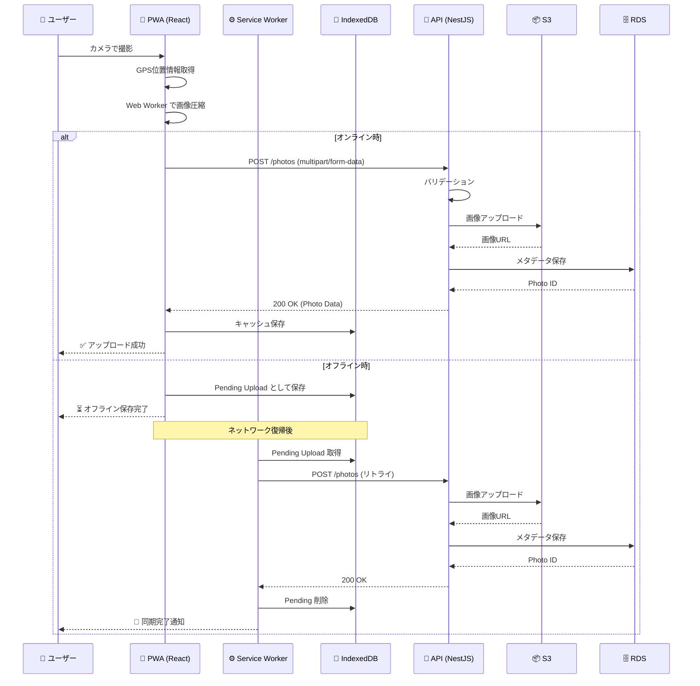

---

## 8. CI/CD パイプライン図

```mermaid
graph LR
    subgraph "Source"
        GitHub["📂 GitHub<br/>(main branch)"]
    end

    subgraph "Build"
        CodeBuild["🏗️ CodeBuild<br/>(Docker Build)"]
        ECR["📦 ECR<br/>(Container Registry)"]
    end

    subgraph "Deploy"
        ECS["🐳 ECS Fargate<br/>(Blue/Green Deploy)"]
    end

    subgraph "Test"
        E2E["🧪 E2E Test<br/>(Playwright)"]
        HealthCheck["❤️ Health Check"]
    end

    GitHub -->|Push| CodeBuild
    CodeBuild -->|Build & Push| ECR
    ECR -->|Pull Image| ECS
    ECS -->|Run Tests| E2E
    E2E -->|Pass| HealthCheck
    HealthCheck -->|Success| ECS
    HealthCheck -->|Fail| CodeBuild

    style GitHub fill:#24292e
    style CodeBuild fill:#ff9900
    style ECR fill:#ff9900
    style ECS fill:#ff9900
    style E2E fill:#2ecc71
    style HealthCheck fill:#e74c3c
```

---

## 9. 認証・認可フロー図

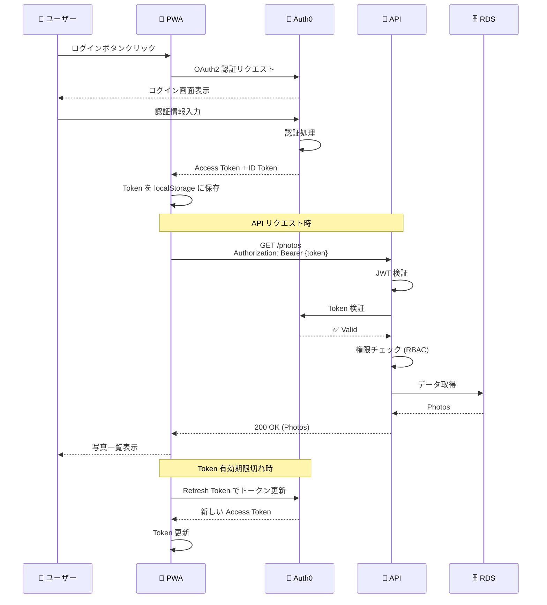

---

## 10. データベース ER 図 (Phase1 主要テーブル)

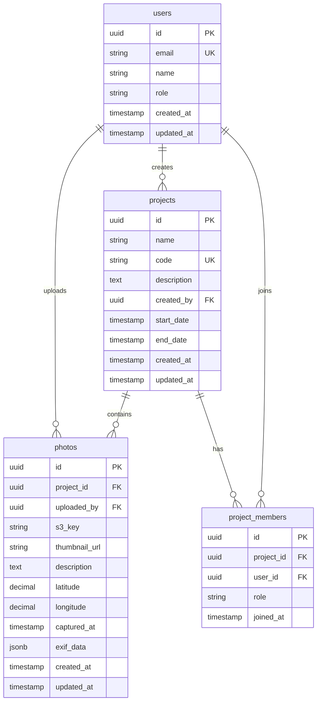

---

## 11. オフライン同期戦略図

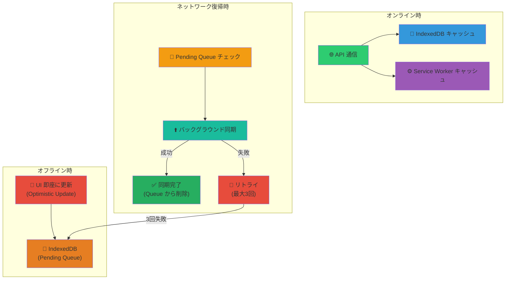

---

## 12. まとめ

本ドキュメントでは、CDCP プロジェクト Phase1 における以下のアーキテクチャ図を提供した。

| # | 図の種類 | 目的 |
|---|---------|------|
| 1 | システム全体構成図 | AWS サービスとの統合全体像 |
| 2 | ネットワーク構成図 (VPC) | Multi-AZ 冗長構成 |
| 3 | モノレポ プロジェクト構造図 | Turborepo 構成 |
| 4 | NestJS 4層アーキテクチャ | バックエンド責務分離 |
| 5 | Phase1 モジュール依存関係図 | 循環依存防止 |
| 6 | React PWA 状態管理フロー | クライアント状態管理戦略 |
| 7 | 写真アップロード シーケンス図 | オンライン・オフライン対応 |
| 8 | CI/CD パイプライン図 | 自動デプロイフロー |
| 9 | 認証・認可フロー図 | Auth0 統合 |
| 10 | データベース ER 図 | Phase1 主要テーブル |
| 11 | オフライン同期戦略図 | PWA オフライン対応 |

これらの図は、開発チーム全体でのアーキテクチャ理解を促進し、実装時の指針となる。

---

**作成日**: 2026-02-15
**バージョン**: 1.0
**作成者**: Architecture Review Agent
